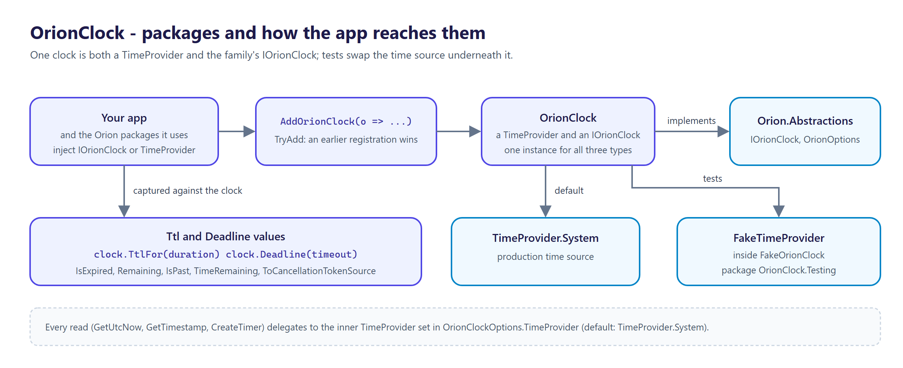
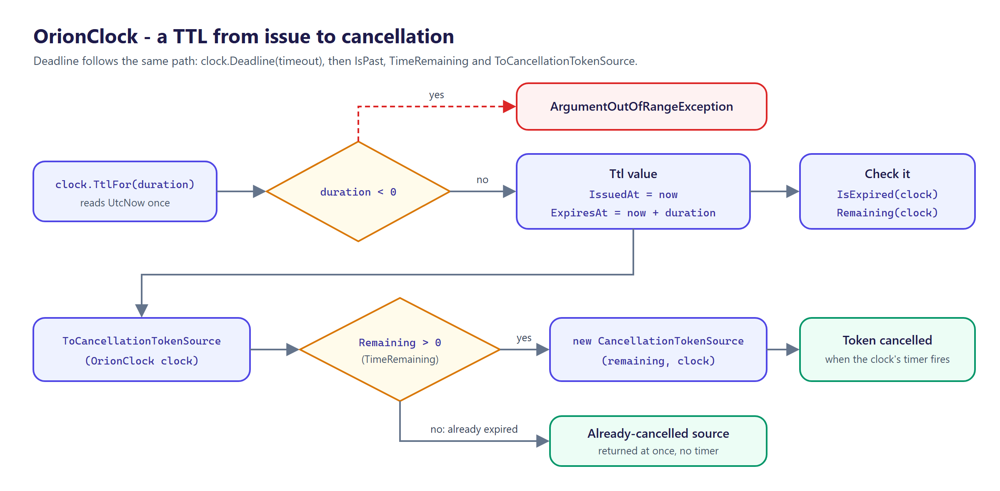
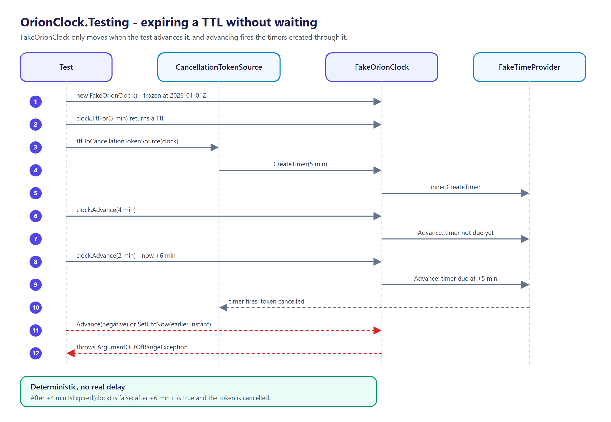

<p align="center">
  <picture>
    <source media="(prefers-color-scheme: dark)" srcset="docs/logo.png">
    
  </picture>
</p>

# OrionClock

[](https://github.com/tunahanaliozturk/OrionClock/actions/workflows/ci-cd.yml)
[](https://www.nuget.org/packages/OrionClock/)
[](LICENSE)


A `TimeProvider`-based clock for the **Orion** family. Time is the most-faked and worst-faked dependency in a .NET backend: teams reach for `DateTime.UtcNow`, sprinkle it through domain code, then discover none of it is testable. .NET 8 shipped `TimeProvider` — the right primitive — but it deliberately left out a schedule/TTL vocabulary, so every package re-derives its own expiry math and flaky "wait for it to expire" tests.

OrionClock is the thin, opinionated layer on top. It **is** a `TimeProvider` (so it drops into any BCL API that takes one), it **is** the family's `IOrionClock`, and it adds the `Ttl`/`Deadline` vocabulary the whole suite shares — deterministic under a fake clock that advances the entire suite at once.



## Packages

| Package | What it contains |
|---------|------------------|
| [`OrionClock`](https://www.nuget.org/packages/OrionClock/) | `OrionClock` (`TimeProvider` + `IOrionClock`), `Ttl`, `Deadline`, `AddOrionClock` |
| [`OrionClock.Testing`](https://www.nuget.org/packages/OrionClock.Testing/) | `FakeOrionClock`, a controllable clock for tests built on `FakeTimeProvider` |

## Features

- **It is a `TimeProvider`** — anything that accepts a `TimeProvider` (`CancellationTokenSource`, `Task.Delay`, timers) accepts an `OrionClock`. Subclasses the BCL primitive rather than replacing it.
- **It is the family's `IOrionClock`** — one clock, registered as `TimeProvider` *and* `IOrionClock`, so every Orion package reads the same time source (unless you registered your own `TimeProvider` or `IOrionClock` first; see One-line DI below).
- **`Ttl`** — a time-to-live as a first-class value (issue instant + expiry captured together). `IsExpired`, `Remaining` (clamped non-negative), `ToCancellationTokenSource` for TTL-driven cancellation.
- **`Deadline`** — a "must complete by" instant with `IsPast`, `TimeRemaining`, and deadline-driven cancellation.
- **Deterministic in tests** — `FakeOrionClock` (in `OrionClock.Testing`) freezes time and only moves on `Advance`/`SetUtcNow`. Because it is built on `TimeProvider`, advancing it fires the timers and cancellation sources created through it — so a 5-minute TTL is expired after `Advance(6m)` and *not* after `Advance(4m)`, with no real delay.
- **One-line DI** (`AddOrionClock`) — registers via `TryAdd`, so a consumer override wins and calling it twice is a no-op. Each service type is a separate `TryAdd`: if you registered only one of `OrionClock`, `TimeProvider` or `IOrionClock` yourself, that one keeps your registration and the other two still resolve to the `OrionClock`, so they no longer share one instance. To swap the time source for all three, set `OrionClockOptions.TimeProvider` (see [Testing](#testing)).
- **AOT- and trim-clean**, verified by a native-binary smoke test in CI. Multi-targets `net8.0`, `net9.0`, `net10.0`.

## Install

```bash
dotnet add package OrionClock

# Testing companion (FakeOrionClock), reference from test projects only
dotnet add package OrionClock.Testing
```

OrionClock depends only on `Microsoft.Extensions.DependencyInjection.Abstractions`. The quick start below builds its own container with `BuildServiceProvider()`, so a console app or test project also needs `dotnet add package Microsoft.Extensions.DependencyInjection`. ASP.NET Core and Generic Host apps already reference it.

## Quick start

```csharp
using Microsoft.Extensions.DependencyInjection;
using Moongazing.Orion.Abstractions.Time;
using Moongazing.OrionClock;

var services = new ServiceCollection();
services.AddOrionClock(); // registers OrionClock as TimeProvider AND IOrionClock

using var provider = services.BuildServiceProvider();
var clock = provider.GetRequiredService<IOrionClock>();

// A TTL as a value, not a raw DateTimeOffset you must remember to compare in UTC.
Ttl ttl = clock.TtlFor(TimeSpan.FromMinutes(5));
if (ttl.IsExpired(clock)) { /* ... */ }
TimeSpan left = ttl.Remaining(clock); // never negative

// A deadline that drives cancellation.
Deadline deadline = clock.Deadline(TimeSpan.FromSeconds(30));
using var cts = deadline.ToCancellationTokenSource((OrionClock)clock);
await DoWorkAsync(cts.Token);
```



## Testing

Point the clock at `FakeOrionClock` and advance time by hand — no real delays, no flakiness.

```csharp
using Moongazing.OrionClock;
using Moongazing.OrionClock.Testing;

var clock = new FakeOrionClock(); // frozen at 2026-01-01Z by default
var ttl = clock.TtlFor(TimeSpan.FromMinutes(5));

clock.Advance(TimeSpan.FromMinutes(4));
Assert.False(ttl.IsExpired(clock));

clock.Advance(TimeSpan.FromMinutes(2)); // now +6m
Assert.True(ttl.IsExpired(clock));
```

Register the fake through options so the whole graph uses it:

```csharp
var fake = new FakeOrionClock();
services.AddOrionClock(o => o.TimeProvider = fake);
```

Because `FakeOrionClock` is a `TimeProvider`, a `CancellationTokenSource` built from a `Ttl` or `Deadline` cancels exactly when you advance past it — deterministically.



## Versioning

Follows [Semantic Versioning](https://semver.org/). Multi-targets `net8.0`, `net9.0`, and `net10.0`. Binds to `Orion.Abstractions` 1.x.

## Documentation

- [CHANGELOG.md](CHANGELOG.md) — release notes.
- [SECURITY.md](SECURITY.md) — how to report a vulnerability.

## Contributing

Contributions are welcome. See [CONTRIBUTING.md](CONTRIBUTING.md) and the [CODE_OF_CONDUCT.md](CODE_OF_CONDUCT.md).

## More from the Orion family

Focused .NET libraries built to one quality bar. Each is usable on its own; several share the small [`Orion.Abstractions`](https://github.com/tunahanaliozturk/Orion.Abstractions) contracts spine, but there is no deep dependency web — pick only what you need:

- [OrionGuard](https://github.com/tunahanaliozturk/OrionGuard) — validation, guard clauses, DDD primitives, domain events
- [Orion.Abstractions](https://github.com/tunahanaliozturk/Orion.Abstractions) — the shared contracts spine: telemetry, options, result, clock
- [OrionAudit](https://github.com/tunahanaliozturk/OrionAudit) — automatic EF Core change-audit trail
- [OrionBeacon](https://github.com/tunahanaliozturk/OrionBeacon) — leader election with fencing tokens
- [OrionGrant](https://github.com/tunahanaliozturk/OrionGrant) — permission / authorization checks
- [OrionKey](https://github.com/tunahanaliozturk/OrionKey) — source-generated strongly-typed IDs
- [OrionLedger](https://github.com/tunahanaliozturk/OrionLedger) — API-key issuance, verification, and rotation
- [OrionLens](https://github.com/tunahanaliozturk/OrionLens) — ambient correlation-context propagation
- [OrionLock](https://github.com/tunahanaliozturk/OrionLock) — distributed locks with fencing tokens
- [OrionOnce](https://github.com/tunahanaliozturk/OrionOnce) — idempotency keys for exactly-once request handling
- [OrionPatch](https://github.com/tunahanaliozturk/OrionPatch) — transactional outbox for EF Core
- [OrionRelay](https://github.com/tunahanaliozturk/OrionRelay) — outbound webhook delivery (HMAC, retries, backoff)
- [OrionResult](https://github.com/tunahanaliozturk/OrionResult) — Result/Option types and a shared error vocabulary
- [OrionSaga](https://github.com/tunahanaliozturk/OrionSaga) — sagas / process managers for long-running workflows
- [OrionShade](https://github.com/tunahanaliozturk/OrionShade) — sensitive-data redaction for logs and telemetry
- [OrionStream](https://github.com/tunahanaliozturk/OrionStream) — server-sent events / streaming hub
- [OrionVault](https://github.com/tunahanaliozturk/OrionVault) — field-level encryption for EF Core

See it all working together in [OrionShowcase](https://github.com/tunahanaliozturk/OrionShowcase), a production-shaped banking sample.

## License

[MIT](LICENSE).
